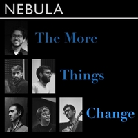
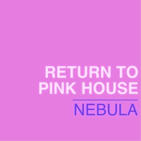
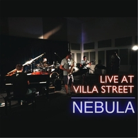
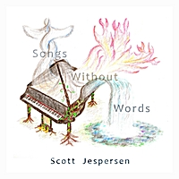

I play piano and write tunes for a jazz quintet,
[Nebula](https://www.nebulajazz.com).

I also play piano, fiddle, and cajon for a contra dance band,
[Pepperjack](https://www.facebook.com/pepperjackcontra/).

# Albums

Some recordings made with [Nebula](https://www.nebulajazz.com):

An album i wrote, recorded, and produced in 2012:

# Other Works

I studied composition under [Tom Flaherty](http://www.tomflahertymusic.com/) at
[Pomona College](https://www.pomona.edu/), where i wrote pieces for chamber
groups and orchestra, including:

- [Rhapsody for Orchestra](https://drive.google.com/file/d/15AZVhfc6ZBk0xg1NE3CtucS1VEJGXyLf/view),
  premiered by the [Pomona College Orchestra](https://orchestra.pomona.edu/).
- [String Quartet No. 1](https://drive.google.com/drive/folders/1GHXB84OC3MRP0Mb5GC4FC785xINIlcZ0)
- [Fairy-Tale Suite](https://drive.google.com/drive/folders/1Hb3gbjeiy2Q2qhq7QGjbTO1iBLSI7Gb7), for woodwind quartet

# Elsewhere on the web

I'm on [SoundCloud](https://soundcloud.com/scott-jespersen),
[BandCamp](https://scottjespersen.bandcamp.com/), and
[YouTube](https://www.youtube.com/channel/UClNAiTUxxaiNuTOzjWWng_Q),
though i don't post much.
